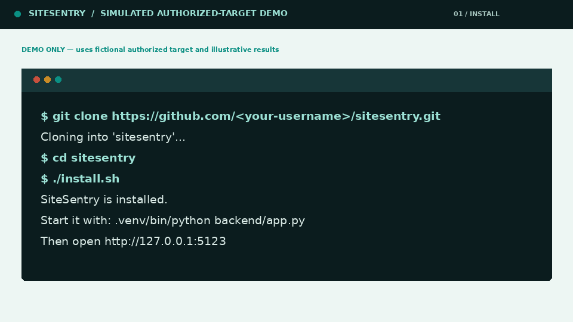
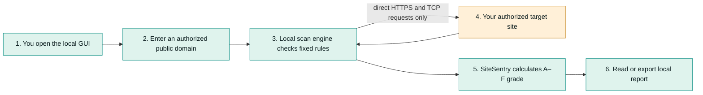
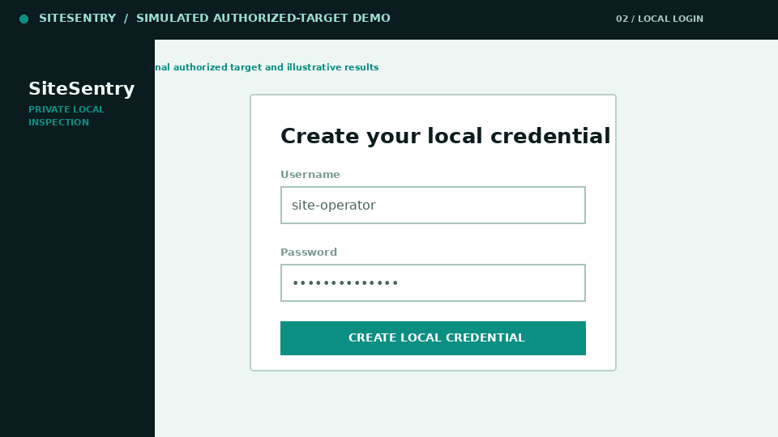
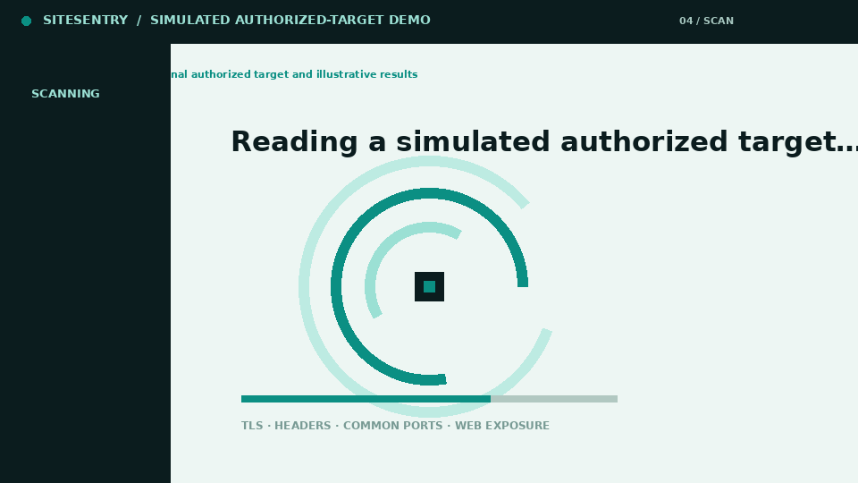
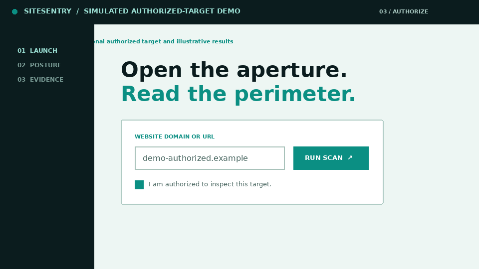
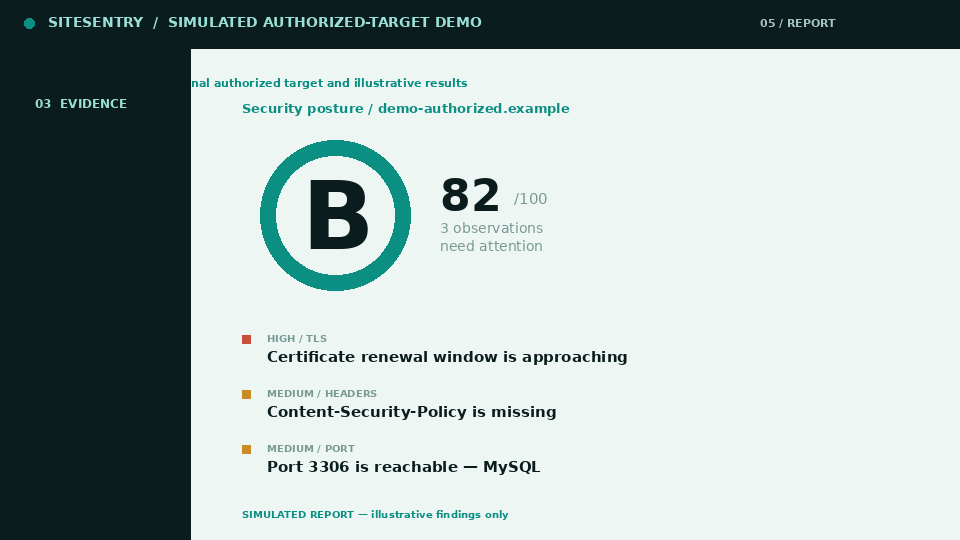

# SiteSentry

[](../../actions/workflows/tests.yml)
[](https://www.python.org/)


> **SiteSentry is a private, local website-security inspection tool for people who need clear answers without sending their site or scan report to a cloud service.** It checks a public website that you own or are authorized to assess for common TLS, response-header, exposed-service, and web-configuration signals; grades the observed posture; and explains the next action. It runs **100% locally**: nothing leaves your machine except direct requests to the site you choose to scan.



> **This is a simulated demonstration.** It uses the fictional target `demo-authorized.example` and illustrative results. The workflow is exactly how SiteSentry behaves when a user scans a website they own or have explicit permission to assess; no third-party website was scanned to create these visuals.

## The workflow in one picture



The application has no cloud login, telemetry, reputation feed, or third-party security API. Your local username is stored as a password hash in local SQLite; reports stay in the running local process until you choose to export HTML, PDF, or JSON.

## Visual quickstart: install, set up, and use SiteSentry

Follow the five steps in order. Each image shows the exact part of the workflow you should expect to see.

### Step 1 — Clone and install

Open a terminal, copy the commands for your operating system, and let the installer create a Python virtual environment plus the dependencies SiteSentry needs.


#### Linux and macOS

```bash
git clone https://github.com/<your-username>/sitesentry.git
cd sitesentry
chmod +x install.sh
./install.sh
.venv/bin/python backend/app.py
```

#### Windows PowerShell

```powershell
git clone https://github.com/<your-username>/sitesentry.git
cd sitesentry
Set-ExecutionPolicy -Scope Process Bypass
.\install.ps1
& .\.venv\Scripts\python.exe .\backend\app.py
```

The server prints the local address when it starts. By default it is `http://127.0.0.1:5123`.

### Step 2 — Open the local GUI and create your credential

Open [http://127.0.0.1:5123](http://127.0.0.1:5123) in your browser. On the first run, SiteSentry asks for a local username and a password of at least 12 characters. The password is hashed before storage; it is not stored as readable text and is not sent to another service.



When you return later, the same screen becomes a local sign-in form. Use the **Paper mode / Night mode** control in the upper-right corner to choose the interface theme you prefer; the choice stays in your browser.

### Step 3 — Enter a website you are authorized to test

After sign-in, the GUI opens the target-inspection screen. Type a public domain or URL that you own or have permission to assess. Tick the authorization checkbox, then select **Run scan**. SiteSentry rejects private, loopback, `.local`, link-local, and reserved targets in this MVP.


> **Only scan with permission.** The confirmation box is a reminder, not legal authorization. Do not scan websites, domains, or network services you do not own or have explicit permission to test.

### Step 4 — Watch the local scan progress

The scanner makes a bounded set of direct requests to the target: it checks TLS, response headers, a small fixed list of common public ports, and a few non-destructive web-exposure paths. It does not try passwords, exploit services, enumerate broad port ranges, or run in the background.





### Step 5 — Read the grade, act on the evidence, and export

SiteSentry starts at 100 points and subtracts fixed amounts for open findings. The report shows a grade from **A** to **F**, a concise explanation of each observation, and a plain-English recommended next move. Use the export controls to download JSON for tools, HTML for sharing, or PDF for a record.



| What you see | What it means | What to do |
| --- | --- | --- |
| **Grade badge** | The total fixed-rule score, from A (strong baseline) to F (critical gaps). | Read the summary, then address critical and high findings first. |
| **Colored finding** | Red is higher priority, amber needs review, teal is an observed pass. | Open **How to fix it** for the direct remediation suggestion. |
| **Export controls** | Your local report is ready to save. | Choose JSON, HTML, or PDF; the file downloads from your local browser. |

## What SiteSentry checks and how scoring works

| Inspection area | Fixed observation rule | Open-finding cost |
| --- | --- | ---: |
| TLS certificate | Expired certificate, certificate expiry within 14 or 30 days, issuer, and public-key strength | 30 / 15 / 8 points, according to severity |
| TLS protocol | A negotiated TLS 1.0 or TLS 1.1 connection is treated as deprecated | 15 points |
| Security headers | Missing CSP, HSTS, X-Frame-Options, X-Content-Type-Options, or Referrer-Policy | 8 / 8 / 8 / 3 / 3 points |
| Common public ports | Small fixed port list: FTP, SSH, Telnet, SMTP, DNS, HTTP/S, SMB, databases, RDP, Redis, and alternate HTTP | 30 / 15 / 8 points, according to service risk |
| Public web files and routes | Bounded requests for `.git/HEAD`, `.env`, `/admin`, directory-listing markers, and verbose error markers | 30 / 15 / 8 points, according to severity |

The score begins at 100 and subtracts the fixed cost of every open finding. A pass costs nothing. A score of 90–100 is **A**, 80–89 is **B**, 70–79 is **C**, 55–69 is **D**, 40–54 is **E**, and 0–39 is **F**. Read the full deterministic rubric in [docs/SCORING.md](docs/SCORING.md).

## Security and privacy

SiteSentry binds to `127.0.0.1` by default, stores one locally chosen username and password hash in a local SQLite database, and creates a local session secret. It does not transmit the target name, credentials, or report to telemetry or cloud services. Its only outbound requests are direct requests to the target entered in the GUI.

The MVP is an inspection tool, not a penetration-testing framework. It does not exploit services, try passwords, identify software vulnerabilities by version, scan private networks, or make background requests. For a production environment, coordinate with the responsible owner and change-management process before running a scan.

## Configuration and reports

All configuration is optional. SiteSentry stores its credential database at `~/.sitesentry/sitesentry.db` by default and binds to `127.0.0.1:5123`. Review [docs/env.example.template](docs/env.example.template) for optional local settings such as an alternative database path or port.

## Continue with the project guides

The visual Quickstart explains how to install and run SiteSentry. These linked documents provide the deeper reference material needed when you want to understand the grade, change local settings, or contribute code.

| Guide | Use it when you need to… | Open the file |
| --- | --- | --- |
| **Scoring rubric** | See the exact fixed point deduction and grade threshold for every severity. | [docs/SCORING.md](docs/SCORING.md) |
| **Local configuration template** | Change the local port, database location, or optional session setting. | [docs/env.example.template](docs/env.example.template) |
| **Contribution guide** | Run tests, follow the coding conventions, open a pull request, or add a new check module. | [CONTRIBUTING.md](CONTRIBUTING.md) |
| **Contributor Covenant** | Understand the expected conduct for issues, pull requests, and community participation. | [CODE_OF_CONDUCT.md](CODE_OF_CONDUCT.md) |

## Contributing

Contributions are welcome when they preserve SiteSentry’s local-first and deterministic design. Read [CONTRIBUTING.md](CONTRIBUTING.md) for local test commands, coding principles, pull-request guidance, and instructions for adding a check module. Each new check belongs in `backend/checks/`, must use a fixed documented rule, must include unit tests, and must update the scoring documentation if it affects a grade.

The repository follows the [Contributor Covenant](CODE_OF_CONDUCT.md). Please read it before opening an issue or pull request.
